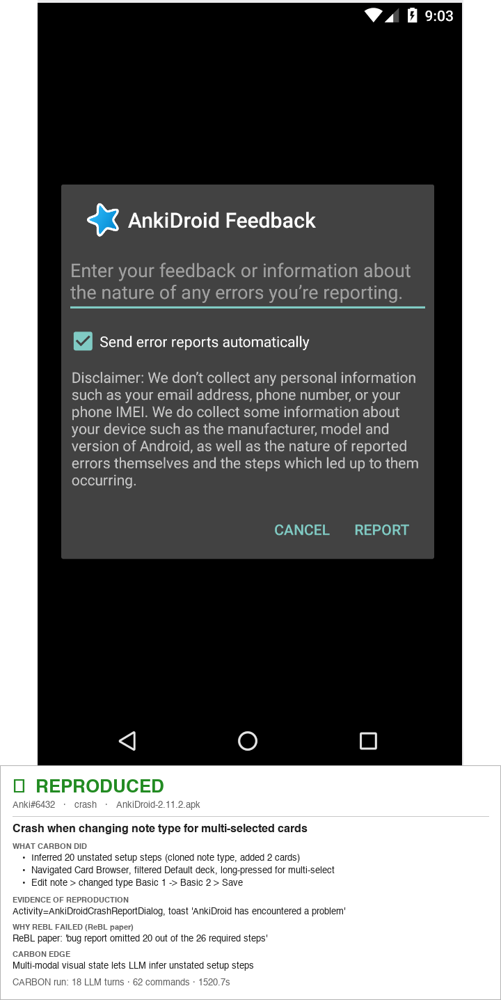
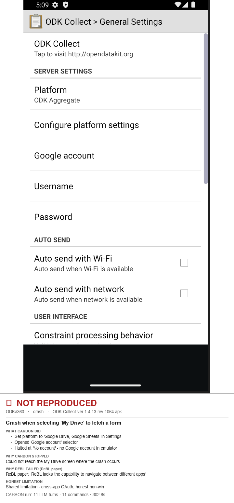
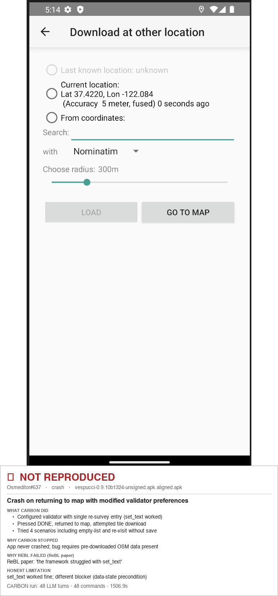
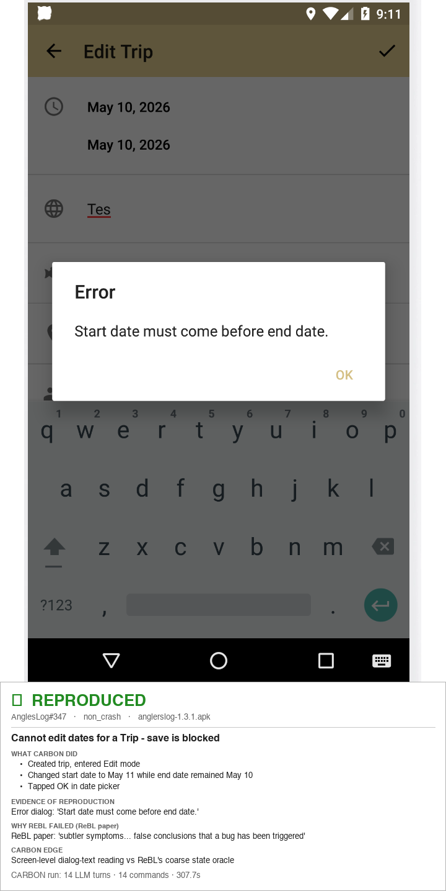
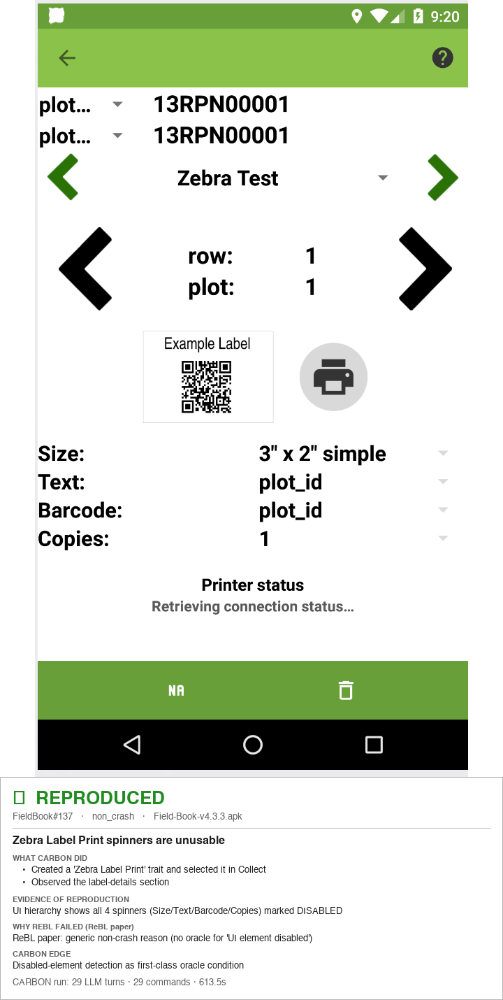
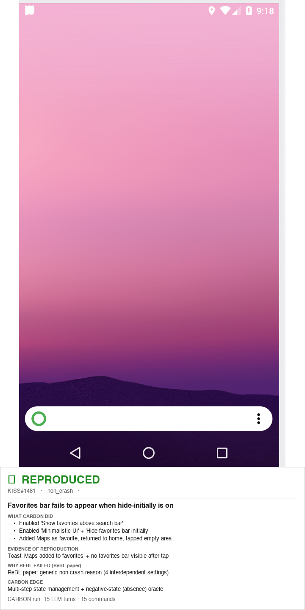
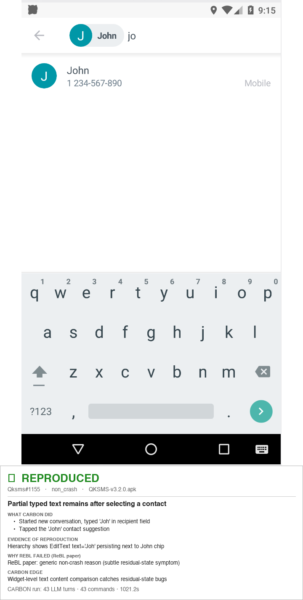

# CARBON — Detailed Per-Bug Results

Full per-bug comparison of CARBON vs ReBL vs ReActDroid vs AdbGPT across the
100-bug gesture-diverse benchmark, plus the 9-bug ReBL Failure Challenge Set.
Each row links to the bug's reproduction folder (bug report + per-tool logs +
annotated screenshot) under `Dataset/`.

Legend: ✅ reproduced · ❌ not reproduced · — not run on this set.

For the headline numbers and setup, see the main [README](README.md).

## Overall Summary

Counts are **audit-confirmed** (the uniform six-criterion legitimacy check),
matching the paper's Table III.

| Tool | SUCCESS | FAIL | Success Rate |
|------|---------|------|--------------|
| CARBON | 88 | 12 | 88.0% |
| ReBL | 34 | 66 | 34.0% |
| ReActDroid | 5 | 95 | 5.0% |
| AdbGPT | 4 | 96 | 4.0% |

> CARBON's dual oracle confirmed 88 of 92 LLM declarations. ReBL self-reported 50
> (34 audit-clean) and AdbGPT self-reported 54 (4 audit-clean); ReActDroid's 5 all
> stand. The per-tool `✅`/`❌` marks in the detailed tables below are each tool's
> **self-reported** outcome; AdbGPT's self-reported successes reduce to the 4 listed
> in the AdbGPT audit note.

## Per-Category Breakdown

| Category | Bugs | CARBON | ReBL | ReActDroid | AdbGPT |
|----------|------|--------|------|------------|--------|
| Double Tap | 21 | 18/21 | 9/21 | 2/21 | 0/21 |
| Drag & Drop | 9 | 8/9 | 1/9 | 0/9 | 0/9 |
| Long Press | 9 | 8/9 | 2/9 | 0/9 | 0/9 |
| Orientation | 6 | 5/6 | 4/6 | 0/6 | 0/6 |
| Pinch/Zoom | 12 | 12/12 | 1/12 | 0/12 | 1/12 |
| Quick Tap | 7 | 5/7 | 0/7 | 0/7 | 0/7 |
| Scroll | 6 | 6/6 | 3/6 | 2/6 | 2/6 |
| Swipe | 30 | 26/30 | 14/30 | 1/30 | 1/30 |
| *ReBL Failure Challenge Set* | *9* | *7/9* | *0/9* | *—* | *—* |

> Counts are **audit-confirmed**, matching the paper's Table III. AdbGPT's
> per-category `✅` marks in the detailed tables are self-reported (54 total);
> only 4 survive the audit (see the AdbGPT audit note).

## Detailed Results

### Double Tap

| Bug ID | App | CARBON | ReBL | ReActDroid | AdbGPT | Screenshot | Remarks | Steps |
|--------|-----|--------|------|------------|--------|------------|---------|-------|
| [FossifyOrg_Calendar_1035](Dataset/double_tap/FossifyOrg_Calendar_1035%20Tested) | FossifyOrg/Calendar | ✅ | ✅ | ✅ | ✅ |  | **Tap/click gesture** → Ap crashes when creating new event | 1. Open app 2. Click on the big + 3. Click on event Then it crashes |
| [FossifyOrg_Calendar_273](Dataset/double_tap/FossifyOrg_Calendar_273%20Tested) | FossifyOrg/Calendar | ✅ | ❌ | ❌ | ✅ |  | **Double-tap gesture** → Setting a default event length doesn't change the default event length | 1. Set default event duration 35 minutes 2. Double tap calendar to make a new event (not using [+] button) |
| [FossifyOrg_Gallery_363](Dataset/double_tap/FossifyOrg_Gallery_363%20Tested) | FossifyOrg/Gallery | ✅ | ✅ | ✅ | ✅ |  | **Double-tap gesture** → webp images when double tapped don't zoom to height of image | 1. Open a .webp images 2. Double tap screen 3. Image doesn't fit to height of screen just zooms in further than edge of image |
| [FossifyOrg_Gallery_584](Dataset/double_tap/FossifyOrg_Gallery_584%20Tested%20F) | FossifyOrg/Gallery | ❌ | ❌ | ❌ | ❌ |  | **Tap/click gesture** → When trying to open some JPG files, the gallery app crashes or returns to the main screen. | 1. Go to any folder with certain photos 2. Click on jpg file 3. The app either crashes or returns to main screen |
| [FossifyOrg_Gallery_678](Dataset/double_tap/FossifyOrg_Gallery_678%20Tested) | FossifyOrg/Gallery | ✅ | ✅ | ❌ | ✅ |  | **Double-tap gesture** → 'Allow 1:1 zooming in with two double taps' not working when pixel size of the photo is lesser than that of… | 1. View a photo that has smaller x/y pixel size than that what the screen has, e.g a photo with 834x700 px. 2. Try to do two double taps (or any kind of taps) and the 1:1 view is not there, it only jumps between full-screen and… |
| [FossifyOrg_Gallery_846](Dataset/double_tap/FossifyOrg_Gallery_846%20Tested) | FossifyOrg/Gallery | ✅ | ❌ | ❌ | ❌ |  | **Double-tap gesture** → "Fill screen" zoom on double tap ignores disabled "Show notch if available" | 1. Disable "Show notch if available" 2. Open an image and double-tap so that the image is zoomed to fill the screen 3. Drag image up/down |
| [FossifyOrg_Gallery_847](Dataset/double_tap/FossifyOrg_Gallery_847%20Tested) | FossifyOrg/Gallery | ✅ | ❌ | ❌ | ✅ |  | **Double-tap gesture** → Invalid "fill screen" zoom for GIF images on double-tap | 1. Open any GIF image 2. Double-tap it |
| [LawnchairLauncher_lawnchair_2910](Dataset/double_tap/LawnchairLauncher_lawnchair_2910%20Tested) | LawnchairLauncher/lawnchair | ✅ | ❌ | ❌ | ❌ |  | **Double-tap gesture** → [BUG] Double tap to sleep no longer works through root access | 1. Enable "suspend" function in gestures 2. Double tap to suspend |
| [LawnchairLauncher_lawnchair_4125](Dataset/double_tap/LawnchairLauncher_lawnchair_4125%20Tested) | LawnchairLauncher/lawnchair | ✅ | ❌ | ❌ | ✅ |  | **Double-tap gesture** → [BUG] android 14, no option to allow restricted setting | 1. Go to - settings, change gestures, double tap to sleep 2. Click on - kebab 3 dot menu, no option to allow restrictive settings 3. See error - Restricted setting |
| [LawnchairLauncher_lawnchair_4786](Dataset/double_tap/LawnchairLauncher_lawnchair_4786%20Tested%20F) | LawnchairLauncher/lawnchair | ❌ | ❌ | ❌ | ✅ |  | **TalkBack + double-tap** → [BUG] Crash when trying to move item using TalkBack action | 1. Hover over a widget 2. With TalkBack enabled, press with 3 fingers to open the actions menu 3. Double-tap the first item in the list, "Actions" |
| [Pool-Of-Tears_GreenStash_170](Dataset/double_tap/Pool-Of-Tears_GreenStash_170%20Tested) | Pool-Of-Tears/GreenStash | ✅ | ❌ | ❌ | ❌ |  | **Accessibility (TalkBack)** → [Bug]: Some accessibility issues | 1. The red boxes in the image below indicate all the UI elements that can be accessed by visually impaired users using… 2. The "Back" button is missing ContentDescriptions. 3. Adding an `onClickLabel` to the Button might also be a good practice. |
| [TeamNewPipe_NewPipe_10750](Dataset/double_tap/TeamNewPipe_NewPipe_10750%20Tested) | TeamNewPipe/NewPipe | ✅ | ✅ | ❌ | ❌ |  | **Playback / generic UI** → Video playback randomly "closed/crashed", content stuck buffering | 1. Play couple videos. 2. Video player might stuck buffering before it crash/close 3. Replay; stuck buffering but frames loaded (seek via double tap) |
| [TeamNewPipe_NewPipe_8338](Dataset/double_tap/TeamNewPipe_NewPipe_8338%20Tested) | TeamNewPipe/NewPipe | ✅ | ❌ | ❌ | ❌ |  | **Double-tap gesture** → Swipe down gesture of Player UI does not work all the times | 1. Keep a video running 2. Double tap video to pause it & immediately try to swipe down |
| [abdallahmehiz_mpvKt_184](Dataset/double_tap/abdallahmehiz_mpvKt_184%20Tested) | abdallahmehiz/mpvKt | ✅ | ❌ | ❌ | ✅ |  | **Double-tap gesture** → Tap error while playing video | 1. Go to any video 2. make use of double tap once 3. Then single tap on left or right moves forward/backward |
| [ankidroid_Anki-Android_17393](Dataset/double_tap/ankidroid_Anki-Android_17393%20Tested) | ankidroid/Anki-Android | ✅ | ✅ | ❌ | ❌ |  | **Tap/click gesture** → [BUG]: IO Cards Go to the Wrong Deck | 1. Settings > General. 2. Deck for new cards → `use current deck`. 3. Select a deck. |
| [cromaguy_Rhythm_281](Dataset/double_tap/cromaguy_Rhythm_281%20Tested) | cromaguy/Rhythm | ✅ | ✅ | ❌ | ❌ |  | **Tap/click gesture** → [BUG]: Double tap needed on Touch Gestures view of Onboarding Setup | 1. Open the app after fresh install. 2. Follow Setup until Touch Gestures. 3. Tap Next Button. |
| [fast4x_RiMusic_1152](Dataset/double_tap/fast4x_RiMusic_1152%20Tested) | fast4x/RiMusic | ✅ | ✅ | ❌ | ✅ |  | **Tap/click gesture** → Unclear Linking and Unresponsive Buttons in Player View | 1. Open the player view. 2. Tap once on the song title or artist name. |
| [gsantner_markor_2746](Dataset/double_tap/gsantner_markor_2746%20Tested) | gsantner/markor | ✅ | ✅ | ❌ | ❌ |  | **Double-tap gesture** → Markor does not recognize URL/link anymore | 1. Double-tap a link to select the entire link. 2. Tap the app icon that opens the link. 3. For 10 days none of this works. |
| [openboard-team_openboard_613](Dataset/double_tap/openboard-team_openboard_613%20Tested) | openboard-team/openboard | ✅ | ❌ | ❌ | ❌ |  | **Double-tap gesture** → Spellchecker flags correctly spelt words if a full-stop is added | 1. Set spellcheck to Openboard. 2. In an SMS client type `<word>.` (manually typing the full-stop). 3. See a spelling mistake wrongly flagged. |
| [openboard-team_openboard_758](Dataset/double_tap/openboard-team_openboard_758%20Tested%20F) | openboard-team/openboard | ❌ | ❌ | ❌ | ✅ |  | **TalkBack + double-tap** → Accessibility: button to go to previous level does not work | 1. Install a screen reader (TalkBack/Jieshuo). 2. Open OpenBoard settings. 3. Go to any settings section. |
| [syt0r_Kanji-Dojo_291](Dataset/double_tap/syt0r_Kanji-Dojo_291%20Tested) | syt0r/Kanji-Dojo | ✅ | ✅ | ❌ | ✅ |  | **Tap/click gesture** → Double-tapping back arrow during transition skips finish-practice dialog | 1. Start a practice session and reveal the answer. 2. Navigate to the vocab info screen. 3. Tap the back arrow, then tap it again before the animation finishes. |

### Drag & Drop

| Bug ID | App | CARBON | ReBL | ReActDroid | AdbGPT | Screenshot | Remarks | Steps |
|--------|-----|--------|------|------------|--------|------------|---------|-------|
| [FossifyOrg_Launcher_304](Dataset/drag_and_drop/FossifyOrg_Launcher_304%20Tested) | FossifyOrg/Launcher | ✅ | ❌ | ❌ | ✅ |  | **Drag and drop gesture** → Accidently creating invisible folders in dock | 1. Have an app on the bottom-right of the dock. 2. Drag and drop another app onto that same location. 3. Invisible folder is created. |
| [FossifyOrg_Notes_59](Dataset/drag_and_drop/FossifyOrg_Notes_59%20Tested) | FossifyOrg/Notes | ✅ | ❌ | ❌ | ✅ |  | **Drag and drop gesture** → Reordering checklists works strangely with move checked to bottom | (see bug report) |
| [LawnchairLauncher_lawnchair_1247](Dataset/drag_and_drop/LawnchairLauncher_lawnchair_1247%20Tested%20F) | LawnchairLauncher/lawnchair | ❌ | ❌ | ❌ | ❌ |  | **TalkBack action** → the launcher keeps crashing when I attempt to move stuff | 1. Set launcher as default. 2. Find an item to move. 3. Bring up the TalkBack actions menu. |
| [LawnchairLauncher_lawnchair_4320](Dataset/drag_and_drop/LawnchairLauncher_lawnchair_4320%20Tested) | LawnchairLauncher/lawnchair | ✅ | ❌ | ❌ | ✅ |  | **Drag and drop gesture** → [BUG] Unable to add any widget | 1. Open "widgets" tab 2. Select any widget 3. Drag and drop it to the home screen |
| [MetrolistGroup_Metrolist_3227](Dataset/drag_and_drop/MetrolistGroup_Metrolist_3227%20Tested) | MetrolistGroup/Metrolist | ✅ | ❌ | ❌ | ❌ |  | **Drag and drop gesture** → Replacement of new song with old song | 1. Add a song to a playlist in custom order. 2. Drag the new song from the bottom to the top. |
| [MetrolistGroup_Metrolist_3561](Dataset/drag_and_drop/MetrolistGroup_Metrolist_3561%20Tested) | MetrolistGroup/Metrolist | ✅ | ❌ | ❌ | ❌ |  | **Drag and drop gesture** → Weird bug when changing list order in custom order format | 1. Create a playlist with some songs. 2. Set custom order. 3. Add a new song and drag it to the top; it replaces another. |
| [NeoApplications_Neo-Launcher_130](Dataset/drag_and_drop/NeoApplications_Neo-Launcher_130%20Tested) | NeoApplications/Neo-Launcher | ✅ | ✅ | ❌ | ✅ |  | **Drag and drop gesture** → Changing the first app in a folder with Covers enabled breaks the folder | 1. Change a 2-app folder into Covers. 2. Reorder so the 2nd app is first. 3. The Cover fails to update. |
| [breezy-weather_breezy-weather_2159](Dataset/drag_and_drop/breezy-weather_breezy-weather_2159%20Tested) | breezy-weather/breezy-weather | ✅ | ❌ | ❌ | ❌ |  | **Drag and drop gesture** → [Old Android default launcher] Can't add widget to home screen | 1. Long press empty area of home screen. 2. Click "Widget". 3. Drag any Breezy Weather widget to the home screen. |
| [fcitx5-android_fcitx5-android_841](Dataset/drag_and_drop/fcitx5-android_fcitx5-android_841%20Tested) | fcitx5-android/fcitx5-android | ✅ | ❌ | ❌ | ✅ |  | **Drag and drop gesture** → Crash sometimes on showing keyboard when preferred input method is from an addon | 1. Install an extra input-method addon. 2. Enable it and drag it to the first position in the list. 3. Crash reproduces intermittently. |

### Long Press

| Bug ID | App | CARBON | ReBL | ReActDroid | AdbGPT | Screenshot | Remarks | Steps |
|--------|-----|--------|------|------------|--------|------------|---------|-------|
| [Anthonyy232_Paperize_325](Dataset/long_press/Anthonyy232_Paperize_325%20Tested) | Anthonyy232/Paperize | ✅ | ❌ | ❌ | ❌ |  | **Long press gesture** → [Bug] Crashing when adding images | 1. Go to the library tab. 2. Click + to create an album. 3. Name and create the album. |
| [Crustack_NotallyX_570](Dataset/long_press/Crustack_NotallyX_570%20Tested) | Crustack/NotallyX | ✅ | ❌ | ❌ | ✅ |  | **Long press gesture** → App crash when note selected, search filter changed, another note selected | 1. Add at least two notes. 2. Long-press to select Note A. 3. Search so Note A leaves the filtered list. |
| [FossifyOrg_File-Manager_195](Dataset/long_press/FossifyOrg_File-Manager_195%20Tested) | FossifyOrg/File-Manager | ❌ | ❌ | ❌ | ✅ |  | **Long press gesture** → Unnecessary refresh of ZIP file icons when closing bottom sheets | 1. Open a folder with a ZIP file. 2. Long-press the ZIP file. 3. Click the "Open with" icon. |
| [FossifyOrg_Launcher_198](Dataset/long_press/FossifyOrg_Launcher_198%20Tested) | FossifyOrg/Launcher | ✅ | ❌ | ❌ | ❌ |  | **Long press folder** → Folder rename dialog: dark text on dark background | 1. Long-press a folder to rename it. 2. The renaming dialog appears. |
| [FossifyOrg_Messages_359](Dataset/long_press/FossifyOrg_Messages_359%20Tested) | FossifyOrg/Messages | ✅ | ❌ | ❌ | ❌ |  | **Long press gesture** → Can't scroll or see participants on conversation details page | 1. Long press any conversation. 2. Tap More options. 3. Tap Conversation details. |
| [FossifyOrg_Messages_416](Dataset/long_press/FossifyOrg_Messages_416%20Tested) | FossifyOrg/Messages | ✅ | ✅ | ❌ | ❌ |  | **Long press (home-screen shortcut)** → New conversation shortcut doesn't work | 1. Long press app icon. 2. Click `New conversation` shortcut. |
| [FossifyOrg_Messages_641](Dataset/long_press/FossifyOrg_Messages_641%20Tested) | FossifyOrg/Messages | ✅ | ✅ | ❌ | ❌ |  | **Long press send button** → SMS scheduling not working | 1. Open the app. 2. Select any conversation. 3. Write a message. |
| [breezy-weather_breezy-weather_1639](Dataset/long_press/breezy-weather_breezy-weather_1639%20Tested) | breezy-weather/breezy-weather | ✅ | ❌ | ❌ | ❌ |  | **Long press gesture** → weather wallpaper causes launcher to freeze and app background closed | 1. Set weather wallpaper as dynamic wallpaper. 2. Open a Vanadium incognito tab. 3. Wait for the wallpaper to change. |
| [espresso3389_methings_34](Dataset/long_press/espresso3389_methings_34%20Tested) | espresso3389/methings | ✅ | ❌ | ❌ | ✅ |  | **Long press gesture** → Image preview UX gaps and instability with Select Text on image blocks | 1. Capture multiple images in a single chat message. 2. Tap an image to enter preview. 3. Swipe to browse images. |

### Orientation

| Bug ID | App | CARBON | ReBL | ReActDroid | AdbGPT | Screenshot | Remarks | Steps |
|--------|-----|--------|------|------------|--------|------------|---------|-------|
| [FossifyOrg_Calendar_1042](Dataset/orientation/FossifyOrg_Calendar_1042%20Tested) | FossifyOrg/Calendar | ✅ | ✅ | ❌ | ✅ |  | **Rotation/orientation change** → Selected day/month/week/year not preserved after rotating | 1. Go to the day view. 2. Swipe to the next day. 3. Rotate the device. |
| [FossifyOrg_Camera_91](Dataset/orientation/FossifyOrg_Camera_91%20Tested) | FossifyOrg/Camera | ✅ | ❌ | ❌ | ❌ |  | **Rotation/orientation change** → Countdown timer does not honor device orientation | 1. Open the app. 2. Set the timer to 10 seconds. 3. Tap the shutter button. |
| [FossifyOrg_Clock_85](Dataset/orientation/FossifyOrg_Clock_85%20Tested%20F) | FossifyOrg/Clock | ❌ | ❌ | ❌ | ✅ |  | **Rotation/orientation change** → Snooze not working in landscape | 1. Set an alarm. 2. Turn off the screen for full-screen alarm. 3. Rotate to landscape before activating snooze. |
| [FossifyOrg_Contacts_197](Dataset/orientation/FossifyOrg_Contacts_197%20Tested) | FossifyOrg/Contacts | ✅ | ✅ | ❌ | ❌ |  | **Rotation/orientation change** → View always changed to contact list when rotating the phone | 1. Open the app. 2. Select favourites or groups tab. 3. Rotate the phone 90 degrees. |
| [Waboodoo_HTTP-Shortcuts_262](Dataset/orientation/Waboodoo_HTTP-Shortcuts_262%20Tested) | Waboodoo/HTTP-Shortcuts | ✅ | ✅ | ❌ | ✅ |  | **Rotation/orientation change** → [BUG] several dialogs disappear on screen rotation | 1. Go to the main activity. 2. Tap add (plus, bottom right). 3. Rotate the screen while the dialog is open. |
| [ankidroid_Anki-Android_16410](Dataset/orientation/ankidroid_Anki-Android_16410%20Tested) | ankidroid/Anki-Android | ✅ | ✅ | ❌ | ✅ |  | **Rotation/orientation change** → [BUG]: Changing screen orientation clears stats' search options | 1. Go to statistics. 2. Search something / select options. 3. Change screen orientation. |

### Pinch/Zoom

| Bug ID | App | CARBON | ReBL | ReActDroid | AdbGPT | Screenshot | Remarks | Steps |
|--------|-----|--------|------|------------|--------|------------|---------|-------|
| [FossifyOrg_Calendar_621](Dataset/pinch_zoom/FossifyOrg_Calendar_621%20Tested) | FossifyOrg/Calendar | ✅ | ✅ | ❌ | ✅ |  | **Pinch/zoom gesture** → Zoom level in weekly view locks | 1. Go to the Weekly view. 2. Zoom out as far as you can. 3. Swipe right to the next week. |
| [FossifyOrg_Camera_23](Dataset/pinch_zoom/FossifyOrg_Camera_23%20Tested) | FossifyOrg/Camera | ✅ | ❌ | ❌ | ✅ |  | **Pinch/zoom gesture** → Doesn't use zoom camera to zoom | 1. Cover the camera and zoom on the stock app. 2. Zoom on Fossify camera with the camera still covered. 3. Quality is bad. |
| [FossifyOrg_Gallery_289](Dataset/pinch_zoom/FossifyOrg_Gallery_289%20Tested) | FossifyOrg/Gallery | ✅ | ❌ | ❌ | ✅ |  | **Pinch/zoom gesture** → "Allow deep zooming images" creates artifacts in many images | 1. Enable "Allow deep zooming images". 2. Open an image. 3. Exit the image or close the app. |
| [FossifyOrg_Gallery_642](Dataset/pinch_zoom/FossifyOrg_Gallery_642%20Tested) | FossifyOrg/Gallery | ✅ | ❌ | ❌ | ✅ |  | **Pinch/zoom gesture** → Zoom doesn't work in photos | 1. Open a photo. 2. Swipe to another photo. 3. Try to zoom in. |
| [FossifyOrg_Gallery_728](Dataset/pinch_zoom/FossifyOrg_Gallery_728%20Tested) | FossifyOrg/Gallery | ✅ | ❌ | ❌ | ✅ |  | **Pinch/zoom gesture** → (Deep zooming) Can not pan after releasing only one finger after pinch zooming | 1. Enable "Allow deep zooming images". 2. Open a picture. 3. Pinch to zoom in with two fingers. |
| [FossifyOrg_Paint_125](Dataset/pinch_zoom/FossifyOrg_Paint_125%20Tested) | FossifyOrg/Paint | ✅ | ❌ | ❌ | ✅ |  | **Pinch/zoom gesture** → Touch location and pen location different after zooming/rotation | (see bug report) |
| [FossifyOrg_Paint_25](Dataset/pinch_zoom/FossifyOrg_Paint_25%20Tested) | FossifyOrg/Paint | ✅ | ❌ | ❌ | ✅ |  | **Pinch/zoom gesture** → Eraser size not relative to zoom on minimum size | 1. Draw a line. 2. Set brush size to minimum. 3. Run eraser through the line. |
| [ankidroid_Anki-Android_16135](Dataset/pinch_zoom/ankidroid_Anki-Android_16135%20Tested) | ankidroid/Anki-Android | ✅ | ❌ | ❌ | ❌ |  | **Pinch/zoom gesture** → [BUG]: Zooming in Statistics Page | 1. Open Statistics. 2. Zoom in then zoom out. 3. Scroll to the bottom. |
| [ankidroid_Anki-Android_17667](Dataset/pinch_zoom/ankidroid_Anki-Android_17667%20Tested) | ankidroid/Anki-Android | ✅ | ❌ | ❌ | ❌ |  | **Long press gesture** → [BUG]: Width of "Deck options" page does not fit to screen | 1. Open the app. 2. Long press a deck. 3. Tap "Deck options". |
| [saber-notes_saber_192](Dataset/pinch_zoom/saber-notes_saber_192%20Tested) | saber-notes/saber | ✅ | ❌ | ❌ | ❌ |  | **Pinch/zoom gesture** → Two finger detection need improvement | 1. Toggle Finger Drawing mode. 2. Select pen. 3. Zoom in. |
| [streetcomplete_StreetComplete_6068](Dataset/pinch_zoom/streetcomplete_StreetComplete_6068%20Tested) | streetcomplete/StreetComplete | ✅ | ❌ | ❌ | ❌ |  | **Pinch/zoom gesture** → OutOfMemoryError when downloading after zoom out | (see bug report) |
| [you-apps_WallYou_216](Dataset/pinch_zoom/you-apps_WallYou_216%20Tested) | you-apps/WallYou | ✅ | ❌ | ❌ | ❌ |  | **Pinch/zoom gesture** → Improper edge-to-edge implementation | (see bug report) |

### Quick Tap

| Bug ID | App | CARBON | ReBL | ReActDroid | AdbGPT | Screenshot | Remarks | Steps |
|--------|-----|--------|------|------------|--------|------------|---------|-------|
| [yairm210_Unciv_13517](Dataset/quick_tap/yairm210_Unciv_13517%20Tested) | yairm210/Unciv | ✅ | ❌ | ❌ | ❌ |  | **Tap/click gesture** → Map editor "partially generate" commands do not work | 1. Open the map editor. 2. Select the "Partial" generation option. 3. Click "Generate landmasses" — no visual change. |
| [LawnchairLauncher_lawnchair_5540](Dataset/quick_tap/LawnchairLauncher_lawnchair_5540%20Tested) | LawnchairLauncher/lawnchair | ✅ | ❌ | ❌ | ✅ |  | **Tap/click gesture** → Home Button Requires Double-Tap to Return to Default Home Page | 1. Set a default home page in settings. 2. Navigate to a different home page. 3. Press the home button. |
| [anilbeesetti_nextplayer_1389](Dataset/quick_tap/anilbeesetti_nextplayer_1389%20Tested) | anilbeesetti/nextplayer | ✅ | ❌ | ❌ | ✅ |  | **Quick tap gesture** → Resuming doesn't work — video stops immediately on tap | 1. Set "Resume" to "Yes". 2. Turn off "Autoplay". 3. Play/fast-forward a video to the end. |
| [ankidroid_Anki-Android_18529](Dataset/quick_tap/ankidroid_Anki-Android_18529%20Tested%20F) | ankidroid/Anki-Android | ❌ | ❌ | ❌ | ❌ |  | **Quick tap gesture** → You can touch some buttons during animations | 1. Tap and hold a deck. 2. With one finger tap rename. 3. With another finger quickly tap and hold a deck. |
| [ankidroid_Anki-Android_19641](Dataset/quick_tap/ankidroid_Anki-Android_19641%20Tested) | ankidroid/Anki-Android | ✅ | ❌ | ❌ | ✅ |  | **Quick tap gesture** → [New study screen] Card was modified error when tapping answer buttons quickly | 1. Open the new study screen with cards to review. 2. Spam the answer buttons or gestures. |
| [ankidroid_Anki-Android_20789](Dataset/quick_tap/ankidroid_Anki-Android_20789%20Tested%20F) | ankidroid/Anki-Android | ❌ | ❌ | ❌ | ✅ |  | **Swipe-up + lock screen** → "Collection synced" notification is too high-priority | 1. Sync your collection (swipe-up or tap the button). 2. Immediately lock the screen. |
| [ankidroid_Anki-Android_7138](Dataset/quick_tap/ankidroid_Anki-Android_7138%20Tested) | ankidroid/Anki-Android | ✅ | ❌ | ❌ | ❌ |  | **Quick tap gesture** → Card skips when tapping Show Answer immediately | (see bug report) |

### Scroll

| Bug ID | App | CARBON | ReBL | ReActDroid | AdbGPT | Screenshot | Remarks | Steps |
|--------|-----|--------|------|------------|--------|------------|---------|-------|
| [Anthonyy232_Paperize_426](Dataset/scroll/Anthonyy232_Paperize_426%20Tested) | Anthonyy232/Paperize | ✅ | ✅ | ❌ | ❌ |  | **Rotation/orientation change** → [Bug] the Privacy Notice button disappears in landscape mode | (see bug report) |
| [Fandroid745_Open-notes_15](Dataset/scroll/Fandroid745_Open-notes_15%20Tested) | Fandroid745/Open-notes | ✅ | ❌ | ❌ | ✅ |  | **Scroll gesture** → No scroll support (Bug) | (see bug report) |
| [FossifyOrg_File-Manager_136](Dataset/scroll/FossifyOrg_File-Manager_136%20Tested) | FossifyOrg/File-Manager | ✅ | ❌ | ❌ | ❌ |  | **Pull-to-refresh / swipe-down** → The screen refresh gesture works when the function is turned off | 1. Go to Settings. 2. Scroll to "Scrolling". 3. Turn off "Enable pull-to-refresh from the top". |
| [ankidroid_Anki-Android_5512](Dataset/scroll/ankidroid_Anki-Android_5512%20Tested) | ankidroid/Anki-Android | ✅ | ❌ | ✅ | ❌ |  | **Scroll gesture** → AnkiDroid scroll bug | (see bug report) |
| [ankidroid_Anki-Android_5544](Dataset/scroll/ankidroid_Anki-Android_5544%20Tested) | ankidroid/Anki-Android | ✅ | ✅ | ✅ | ✅ |  | **Scroll gesture** → AnkiDroid scroll bug | (see bug report) |
| [netmackan_ATimeTracker_124](Dataset/scroll/netmackan_ATimeTracker_124%20Tested) | netmackan/ATimeTracker | ✅ | ✅ | ❌ | ✅ |  | **Scroll gesture** → Could not scroll on the menu | (see bug report) |

### Swipe

| Bug ID | App | CARBON | ReBL | ReActDroid | AdbGPT | Screenshot | Remarks | Steps |
|--------|-----|--------|------|------------|--------|------------|---------|-------|
| [A-EDev_Flow_27](Dataset/swipe/A-EDev_Flow_27%20Tested) | A-EDev/Flow | ✅ | ✅ | ❌ | ❌ |  | **Swipe-down in fullscreen** → brightness/volume gestures trigger when opening control panel | 1. Play a video in fullscreen. 2. Swipe down from top for notifications. |
| [A-EDev_Flow_284](Dataset/swipe/A-EDev_Flow_284%20Tested) | A-EDev/Flow | ✅ | ✅ | ❌ | ❌ |  | **Pinch-in + swipe** → Pinch-in zoom breaks player gestures; volume/brightness unresponsive | 1. Open any video. 2. Start playback. 3. Pinch-to-zoom the video. |
| [CodeWorksCreativeHub_mLauncher_809](Dataset/swipe/CodeWorksCreativeHub_mLauncher_809%20Tested) | CodeWorksCreativeHub/mLauncher | ✅ | ✅ | ❌ | ✅ |  | **Swipe gesture** → [Bug Report] Short swipe gesture broken | 1. Go to homescreen. 2. Use swipe gesture without long press. 3. No response. |
| [Droid-ify_client_238](Dataset/swipe/Droid-ify_client_238%20Tested) | Droid-ify/client | ✅ | ✅ | ✅ | ✅ |  | **Back gesture + tap** → [BUG] App crashing on changing settings | 1. Open settings. 2. Toggle any setting. 3. Go back via the arrow or gesture navigation. |
| [Droid-ify_client_583](Dataset/swipe/Droid-ify_client_583%20Tested) | Droid-ify/client | ✅ | ✅ | ❌ | ✅ |  | **Swipe in image viewer** → [BUG] Swiping images zooms instead | (see bug report) |
| [FossifyOrg_Calendar_1103](Dataset/swipe/FossifyOrg_Calendar_1103%20Tested) | FossifyOrg/Calendar | ❌ | ❌ | ❌ | ❌ |  | **TalkBack navigation** → announce event count on a day in monthly view | 1. Enable TalkBack. 2. Open the monthly view. 3. Move through days with TalkBack navigation. |
| [FossifyOrg_Calendar_153](Dataset/swipe/FossifyOrg_Calendar_153%20Tested) | FossifyOrg/Calendar | ✅ | ✅ | ❌ | ✅ |  | **Swipe gesture** → Swiping in monthly view is a pain | 1. Open monthly view. 2. Swipe to the next month. 3. It snaps back in 8/10 cases. |
| [FossifyOrg_Clock_156](Dataset/swipe/FossifyOrg_Clock_156%20Tested%20F) | FossifyOrg/Clock | ❌ | ❌ | ❌ | ✅ |  | **Swipe gesture** → Timer alarm turned off by swiping from the status bar | 1. Set up a timer and start it. 2. Wait for the alarm. 3. Pull down from the status bar. |
| [FossifyOrg_Gallery_237](Dataset/swipe/FossifyOrg_Gallery_237%20Tested) | FossifyOrg/Gallery | ✅ | ❌ | ❌ | ✅ |  | **Vertical swipe (media gesture)** → Vertical gesture to adjust video volume does not work | (see bug report) |
| [FossifyOrg_Gallery_940](Dataset/swipe/FossifyOrg_Gallery_940%20Tested) | FossifyOrg/Gallery | ✅ | ❌ | ❌ | ❌ |  | **Rotate + vertical swipe** → Disabled notch overlaps brightness control area | 1. Disable "Show notch if available". 2. Enable brightness vertical gestures. 3. Rotate to landscape with notch on the left. |
| [FossifyOrg_Launcher_66](Dataset/swipe/FossifyOrg_Launcher_66%20Tested) | FossifyOrg/Launcher | ✅ | ❌ | ❌ | ❌ |  | **Horizontal swipe (page transition)** → Slow, jerky animation when opening a folder or swiping between screens | 1. Set Fossify Launcher as main launcher. 2. Add icons across 2 screens. 3. Swipe left and right. |
| [FossifyOrg_Messages_80](Dataset/swipe/FossifyOrg_Messages_80%20Tested) | FossifyOrg/Messages | ✅ | ❌ | ❌ | ❌ |  | **Back gesture / home-screen shortcut** → Navigation stack gets too large | 1. Tap + to compose a new message. 2. Select a contact. 3. Minimize the app to the home screen. |
| [FossifyOrg_Notes_190](Dataset/swipe/FossifyOrg_Notes_190%20Tested) | FossifyOrg/Notes | ✅ | ✅ | ❌ | ✅ |  | **Swipe gesture** → crash while using the search field | 1. In a long note, search any text. 2. Use the arrows until the screen drops. 3. Swipe to the next note. |
| [Kin69_EasyNotes_356](Dataset/swipe/Kin69_EasyNotes_356%20Tested) | Kin69/EasyNotes | ✅ | ❌ | ❌ | ❌ |  | **Back gesture in split-screen** → [BUG] | (see bug report) |
| [LawnchairLauncher_lawnchair_4642](Dataset/swipe/LawnchairLauncher_lawnchair_4642%20Tested) | LawnchairLauncher/lawnchair | ✅ | ✅ | ❌ | ✅ |  | **Swipe gesture** → Gesture navigation gets locked in one orientation until restart | 1. Start Lawnchair. 2. Switch orientation. 3. Recents screen won't open. |
| [LawnchairLauncher_lawnchair_4708](Dataset/swipe/LawnchairLauncher_lawnchair_4708%20Tested) | LawnchairLauncher/lawnchair | ✅ | ✅ | ❌ | ✅ |  | **Swipe up (ghost app)** → swiping up to go home creates a "ghost app" in Recents | 1. Enable gesture navigation. 2. Set Lawnchair as default launcher. 3. Go to the homescreen. |
| [LawnchairLauncher_lawnchair_5496](Dataset/swipe/LawnchairLauncher_lawnchair_5496%20Tested) | LawnchairLauncher/lawnchair | ✅ | ✅ | ❌ | ✅ |  | **Swipe-up to recents** → [BUG] Lawnchair crashes in the recent menu | 1. Open any app. 2. Open Recents (swipe up and hold or Recents button). 3. Lawnchair crashes. |
| [MetrolistGroup_Metrolist_3391](Dataset/swipe/MetrolistGroup_Metrolist_3391%20Tested) | MetrolistGroup/Metrolist | ✅ | ✅ | ❌ | ❌ |  | **Edge-swipe back** → Back gesture not working in the player screen | (see bug report) |
| [OuterTune_OuterTune_1044](Dataset/swipe/OuterTune_OuterTune_1044%20Tested) | OuterTune/OuterTune | ✅ | ✅ | ❌ | ❌ |  | **Bottom-nav tap (behaves as back)** → Pressing Home or any button activates back gesture | (see bug report) |
| [anilbeesetti_nextplayer_1127](Dataset/swipe/anilbeesetti_nextplayer_1127%20Tested) | anilbeesetti/nextplayer | ✅ | ✅ | ❌ | ✅ |  | **Vertical swipe in landscape** → volume/brightness gesture too sensitive in landscape | 1. Open a video in landscape. 2. Swipe down from the top for notifications. 3. Volume/brightness changes instead. |
| [ankidroid_Anki-Android_14934](Dataset/swipe/ankidroid_Anki-Android_14934%20Tested%20F) | ankidroid/Anki-Android | ❌ | ❌ | ❌ | ✅ |  | **TalkBack swipe** → TalkBack can't see front/back of cards during study | 1. Enable TalkBack. 2. Open AnkiDroid. 3. Touch the deck to start reviewing. |
| [bartoostveen_ViTune_710](Dataset/swipe/bartoostveen_ViTune_710%20Tested) | 25huizengek1/ViTune | ✅ | ❌ | ❌ | ✅ |  | **Notification swipe** → Notification shows wrong album art for current song | 1. Play a song. 2. Swipe down to open the notification panel. 3. Wrong album art shown. |
| [breezy-weather_breezy-weather_205](Dataset/swipe/breezy-weather_breezy-weather_205%20Tested) | breezy-weather/breezy-weather | ✅ | ❌ | ❌ | ✅ |  | **Swipe-left gesture** → Swipe-left animation stays after cancelling provider dialog | 1. Add the current location. 2. Swipe left to open the provider dialog. 3. Tap cancel or outside. |
| [breezy-weather_breezy-weather_85](Dataset/swipe/breezy-weather_breezy-weather_85%20Tested) | breezy-weather/breezy-weather | ✅ | ❌ | ❌ | ✅ |  | **Notification swipe** → Persistent notification setting on/off is inverted | 1. Settings → widgets. 2. Activate the notification widget. 3. Leave the persistent option disabled. |
| [dessalines_thumb-key_371](Dataset/swipe/dessalines_thumb-key_371%20Tested) | dessalines/thumb-key | ✅ | ❌ | ❌ | ❌ |  | **Swipe gesture** → Swipe input eaten on capitalization/mode switch | (see bug report) |
| [iamrasel_lunar-launcher_82](Dataset/swipe/iamrasel_lunar-launcher_82%20Tested) | iamrasel/lunar-launcher | ✅ | ❌ | ❌ | ✅ |  | **Home-button + launcher crash** → Random crashes when closing applications | 1. Have an app open. 2. Swipe up to background it. 3. Lunar crashes. |
| [libre-tube_LibreTube_8245](Dataset/swipe/libre-tube_LibreTube_8245%20Tested) | libre-tube/LibreTube | ❌ | ❌ | ❌ | ❌ |  | **Back button vs swipe-down** → Laggy animation when minimizing player | (see bug report) |
| [msasikanth_twine_1566](Dataset/swipe/msasikanth_twine_1566%20Tested) | msasikanth/twine | ✅ | ❌ | ❌ | ❌ |  | **Back gesture (predictive)** → [BUG] Incomplete Predictive Back Animation | (see bug report) |
| [you-apps_ClockYou_85](Dataset/swipe/you-apps_ClockYou_85%20Tested) | you-apps/ClockYou | ✅ | ✅ | ❌ | ✅ |  | **Back gesture** → App cycles through visited tabs on back gesture instead of closing | 1. Open the app. 2. Navigate to any other tab. 3. Perform a back gesture. |
| [you-apps_ConnectYou_155](Dataset/swipe/you-apps_ConnectYou_155%20Tested) | you-apps/ConnectYou | ✅ | ❌ | ❌ | ❌ |  | **Back gesture** → Back on search bar quits the app | 1. Click the search bar. 2. Press the back gesture/button. |

### ReBL Failure Challenge Set

**Audit scope.** ReBL (ISSTA'24) §5.1.1 explicitly lists 9 bug reports — 4 crash + 5 non-crash — where ReBL itself failed to reproduce the bug on its own 96-bug benchmark. We re-crawled those 9 issues from GitHub, rebuilt them as a standalone challenge dataset at `Dataset/ReBL_Failed_Dataset/`, and ran CARBON against each. Every row below is a bug ReBL's paper documents as a failure, so **ReBL = FAIL on all 9 by construction**. ReActDroid and AdbGPT are marked `—` because this cross-dataset comparison is strictly CARBON vs ReBL.

**Audit result.** CARBON reproduced **7 of 9 (77.8%)** — 2 of 4 crash bugs and all 5 non-crash bugs. The 2 non-reproductions are honestly documented limitations:
- **ODK#360** — Cross-app Google Drive OAuth. Same architectural limitation as ReBL; not claimed as a win.
- **Osmeditor#637** — CARBON's `set_text` worked on the very widget ReBL flagged, but the bug also requires pre-downloaded OSM map data before the crash path fires.

| Bug ID | App | CARBON | ReBL | ReActDroid | AdbGPT | Screenshot | Remarks | Steps |
|--------|-----|--------|------|------------|--------|------------|---------|-------|
| [alexstyl_Memento-Calendar_169](Dataset/ReBL_Failed_Dataset/crash/alexstyl_Memento-Calendar_169) | alexstyl/Memento-Calendar | ✅ | ❌ | — | — |  | **Custom-view picker (crash)** → Vision + `swipe_region` reached the NumberPicker UIAutomator2 can't enumerate; Feb 31 fired FATAL EXCEPTION. ReBL paper: *"UI Automator2 fails to extract custom views from the hierarchy."* | 1. Create new contact via '+'. 2. Tap Birthday, disable 'Include year'. 3. Slide month to March, day to 31. 4. Slide month to February. 5. Tap Set. |
| [ankidroid_Anki-Android_6432](Dataset/ReBL_Failed_Dataset/crash/ankidroid_Anki-Android_6432) | ankidroid/Anki-Android | ✅ | ❌ | — | — |  | **Sparse bug report (crash)** → Multi-modal visual state let the LLM infer unstated setup; multi-select + type change fired the crash dialog. ReBL paper: *"the bug report omitted 20 out of the 26 required steps."* | 1. Clone 'Basic' note type. 2. Add two cards to Basic 1. 3. Card Browser → multi-select → Edit → change type Basic 1→Basic 2. |
| [getodk_collect_360](Dataset/ReBL_Failed_Dataset/crash/getodk_collect_360) | getodk/collect | ❌ | ❌ | — | — |  | **Cross-app OAuth (crash)** → Shared limitation. Both tools can't navigate the Google Drive OAuth flow. ReBL paper: *"ReBL lacks the capability to navigate between different apps."* | 1. Set platform to Google Drive. 2. Specify account. 3. Get Blank Form. 4. Select My Drive. 5. Crash. |
| [MarcusWolschon_osmeditor4android_637](Dataset/ReBL_Failed_Dataset/crash/MarcusWolschon_osmeditor4android_637) | MarcusWolschon/osmeditor4android | ❌ | ❌ | — | — |  | **Data-state precondition (crash)** → CARBON's `set_text` worked (ReBL's stated blocker), but the bug needs pre-downloaded OSM data. ReBL paper: *"the framework struggled with set_text."* | 1. Remove all Validator entries except one. 2. Set key "shop", value "*", max age 0. 3. Press DONE and return to map. 4. App crashes. |
| [cohenadair_anglers-log_347](Dataset/ReBL_Failed_Dataset/non_crash/cohenadair_anglers-log_347) | cohenadair/anglers-log | ✅ | ❌ | — | — |  | **Dialog-text oracle (non-crash)** → Read the error popup *"Start date must come before end date."* verbatim. | 1. Create Trip. 2. Edit Trip. 3. Modify date. 4. Press Save. 5. Observe error. |
| [PhenoApps_Field-Book_137](Dataset/ReBL_Failed_Dataset/non_crash/PhenoApps_Field-Book_137) | PhenoApps/Field-Book | ✅ | ❌ | — | — |  | **Disabled-element oracle (non-crash)** → Detected all 4 Zebra Label spinners marked DISABLED in the hierarchy. | 1. Create a 'Zebra Label Print' trait. 2. Select it for scoring. 3. Go to Collect and move to the Zebra trait. 4. Scroll for label details. |
| [Neamar_KISS_1481](Dataset/ReBL_Failed_Dataset/non_crash/Neamar_KISS_1481) | Neamar/KISS | ✅ | ❌ | — | — |  | **Multi-setting + negative-state oracle (non-crash)** → Configured 4 interdependent toggles, then confirmed the favorites bar never appeared. | 1. Set an app as favorite. 2. Enable 'Show favorites above search bar'. 3. Enable Minimalistic UI. 4. Enable 'Hide favorites bar initially'. 5. Tap home. |
| [lfuelling_lrkFM_34](Dataset/ReBL_Failed_Dataset/non_crash/lfuelling_lrkFM_34) | lfuelling/lrkFM | ✅ | ❌ | — | — |  | **Semantic target selection (non-crash)** → Navigated INTO a different folder before pasting, avoiding ReBL's same-folder false positive. ReBL paper: *"ReBL performs move and paste within the same folder."* | 1. 'Move' any file. 2. Navigate to a different folder. 3. Try to paste. 4. File not moved. |
| [moezbhatti_qksms_1155](Dataset/ReBL_Failed_Dataset/non_crash/moezbhatti_qksms_1155) | moezbhatti/qksms | ✅ | ❌ | — | — |  | **Widget-text comparison (non-crash)** → Caught leftover `EditText text="Joh"` persisting next to the John chip. | 1. Start new conversation. 2. Type a partial name ('Joh'). 3. Tap the suggested contact. 4. Partial text remains. |

## Audit Notes

### ReBL
ReBL was run on all 100 bugs with Gemini 2.5 Pro via Vertex AI. Every SUCCESS verdict was audited against the bug report to confirm ReBL actually observed the buggy behavior. 16 initially-claimed successes were reclassified as FAIL (10 where the LLM declared victory without verifying the bug, plus 6 where the LLM itself said `'result': 'fail'` but the parser misread the reason). **Final ReBL legitimate success rate: 34/100 (34.0%).**

### CARBON
Starting from 92 initial SUCCESS verdicts, 7 were flagged during audit and re-run with screen recording. Five were confirmed legitimate (recordings show the buggy behavior). Two remained unverifiable because the symptom is a sub-perceptual animation glitch the oracle cannot measure (`FossifyOrg_File-Manager_195` ZIP icon flicker, `libre-tube_LibreTube_8245` back-button animation lag) and were flipped to FAIL. Two further animation/TalkBack-only successes (`FossifyOrg_Calendar_1103`, `ankidroid_Anki-Android_14934`) were also flipped, giving the final **88/100 (88.0%).**

### AdbGPT
AdbGPT reported 54/100 SUCCESS, but only 4/100 completed all steps without `[MISSING]` actions. AdbGPT has no oracle: when it cannot execute a step it taps a random element, marks the step `[MISSING]`, and continues. The 4 genuinely clean successes are `FossifyOrg_Camera_23`, `ankidroid_Anki-Android_5544`, `netmackan_ATimeTracker_124`, `iamrasel_lunar-launcher_82`.

### ReActDroid
ReActDroid's **5/100 stands unchanged under the audit** — all five are crash bugs where the logcat oracle fires within the first few steps and the terminal verdict matches, so there are no successes to reclassify. Its low overall rate reflects its restricted three-verb action space (click, input, long-press) with no swipe, scroll, or gesture support, rather than success-rate inflation. **Final ReActDroid success rate: 5/100 (5.0%).**

### Bugs no tool reproduced
`LawnchairLauncher_lawnchair_1247` (Drag & Drop), `ankidroid_Anki-Android_18529` (Quick Tap), `FossifyOrg_Gallery_584` (Double Tap).
